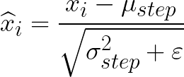
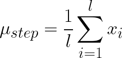
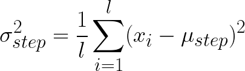

# BatchNormalization

---
### `t`
* [batch](../../terms.md#batch)
---

Преобразует входные данные в пределах одного батча в отрезок от `-1` до `1`

Работает по следующей формуле:



Где *мю*:

 

Один батч, а *сигма* — дисперсия батча:



> **Дисперсия** — математическое ожидание квадрата отклонения 
> этой случайной величины от ее математического ожидания

*Эпсилон* — небольшое число, необходимое для того, 
чтобы подкоренное выражение было больше нуля

```python
from tensorflow.keras.layers import BatchNormalization

BatchNormalization(
    axis=... # на какую размерность применять нормализацию 
)
```