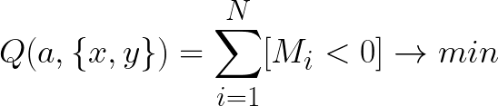

# Линейная классификация 

Задача линейной классификации — определить, 
относится ли объект к какому-то классу или нет.
На выходе модели всего один нейрон, принимающий значения от `-1` до `1`

## Отступ 
Отступом называют функцию, которая показывает, 
верно ли классифицирован объект.

Отступ определяется функцией *M*: 

Где `a` - модель, возвращающая число из диапазона `[-1; 1]`.
Если **отступ** меньше нуля, то объект классифицирован неверно: 
> Объект принадлежит классу, но был определен неверно: `1 * (-1) = -1`,
> объект не принадлежит классу, но был определен как принадлежащий: `-1 * 1 = -1`
> В остальных случаях объект определится верно.

Для минимизации ошибки нужно, 
чтобы сумма элементов, 
для которых отступ меньше нуля, стремилась к минимуму.

